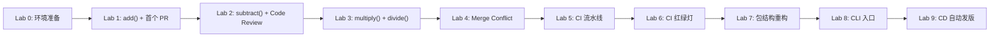

# <center> python-calculator
# 🚀 Git 协作与 CI/CD 实战手册

> **从零开始的双人协作仿真 · Python 计算器项目**

欢迎来到《Git 协作与 CI/CD 实战手册》！本手册旨在通过一个真实的 Python 计算器项目，带领你从零开始体验软件工程中的代码协作与自动化流水线。你将通过模拟两个开发者（Alice 和 Bob）的互动，掌握在真实工程团队中必备的 Git 分支协作、Code Review、解决冲突以及构建 GitHub Actions CI/CD 流水线的实战技能。

---

## 🎯 学习者画像

- **Git 经验**：掌握基础 Git 命令（add, commit, push），但缺乏分支管理、Pull Request（PR）及团队协作经验。
- **Python 经验**：了解基础语法，但无测试框架（如 pytest）的实战经验。
- **CI/CD 认知**：听过 CI/CD 概念，但尚未亲手搭建过自动化流水线。

---

## 🛠️ 环境要求

在开始之前，请确保你的系统满足以下条件：

- **操作系统**：Windows 11 + PowerShell（所有命令行操作均基于 PowerShell）
- **Git**：2.47 或更高版本
- **Python**：3.13 或更高版本
- **GitHub 账号**：准备一个 GitHub 账号
- **SSH 密钥**：已配置并关联到 GitHub 账号

---

## 🏗️ 仿真架构说明

为了在单人环境下体验真实的团队协作，我们将采用以下仿真架构：

- **单机模拟双人**：在同一台电脑上，使用单一 GitHub 账号模拟双人协作。
- **独立工作区**：你将克隆两次仓库，创建两个完全独立的目录：
  - `calculator-alice/`（扮演 Alice）
  - `calculator-bob/`（扮演 Bob）
- **身份隔离**：通过 Git 的局部配置（`git config user.name`），为两个目录配置不同的提交者身份，确保提交记录清晰可辨。
  - **注意**：条件允许的话，为两个目录配置不同的邮箱 `git config user.email` ，邮箱需要提前注册GitHub，可以体验PR被Request changes。
- **操作边界**：所有**本地开发**（写代码、提交代码）均使用 PowerShell 中的 Git 命令行；所有**远端协同**（提 PR、Code Review、合并代码）均通过 GitHub 网页端完成。

---

## 🗺️ 学习路径总览

| Lab | 标题 | 核心技能 | 预估耗时 |
|:---|:---|:---|:---|
| [Lab 0](./labs/lab00-setup.md) | 环境准备与双人工作区搭建 | GitHub 仓库创建、克隆、身份隔离 | 20 min |
| [Lab 1](./labs/lab01-first-commit.md) | 第一次提交与 PR | 分支、提交、推送、PR 发起与合并 | 30 min |
| [Lab 2](./labs/lab02-bob-joins.md) | Bob 加入协作 | Code Review、行级批注、追加提交 | 35 min |
| [Lab 3](./labs/lab03-parallel-dev.md) | 并行开发 | 双人并行分支、异常处理、pytest.raises | 35 min |
| [Lab 4](./labs/lab04-merge-conflict.md) | 合并冲突 | Merge Conflict 识别与解决 | 40 min |
| [Lab 5](./labs/lab05-ci-setup.md) | CI 自动化 | GitHub Actions、Branch Protection | 40 min |
| [Lab 6](./labs/lab06-ci-red-green.md) | CI 红绿灯 | 故障注入、日志排查、修复闭环 | 30 min |
| [Lab 7](./labs/lab07-refactor.md) | 模块化重构 | Python 包结构、pyproject.toml | 35 min |
| [Lab 8](./labs/lab08-cli.md) | CLI 交互入口 | REPL 循环、console_scripts | 30 min |
| [Lab 9](./labs/lab09-cd-release.md) | CD 自动发版 | Tag 触发、Changelog、GitHub Release | 40 min |
| | **总计** | | **~335 min** |

---

## 📈 项目演进路线图



---

## 📌 约定与图例

在学习过程中，请注意识别以下特殊标记，它们会指引你顺利完成每个步骤：

- `**📍 角色：Alice | 目录：calculator-alice/**`：指示当前操作应在哪个目录中以哪个角色的身份进行。
- `**📍 操作位置：GitHub 网页端**`：指示当前操作需要在浏览器中打开 GitHub 进行。
- `### ✅ 检查点（Checkpoint）`：每个关键步骤后的状态验证，帮助你确认操作是否正确。
- `💡`：知识点讲解与原理剖析。
- `⚠️`：常见错误陷阱与避坑指南。
- **命令规范**：所有终端命令均专为 PowerShell 设计（如使用 `Set-Location` 或明确目录上下文），无需担心 Bash 兼容性问题。
- **提交规范**：所有 Commit Message 均遵循 Conventional Commits 规范（如 `feat:`, `fix:`, `test:`, `docs:` 等）。

---

## 🚀 开始学习

准备好体验从代码小白到工程老手的蜕变了吗？

👉 [立即开始 → Lab 0: 环境准备](./labs/lab00-setup.md)

---
## 🎯 快速开始

### 方式 A：从 GitHub Release 直接安装
```bash
# 使用 uv 一键安装
uv tool install https://github.com/gilililila/python-calculator/releases/download/v1.0.0/alice_calculator-1.0.0-py3-none-any.whl

# 直接在终端全局调用
calculator
```

### 方式 B：从源码运行与开发
```bash
# 克隆代码仓库
git clone https://github.com/gilililila/python-calculator.git
cd python-calculator

# 一键同步环境与依赖
uv sync

# 运行CLI计算器
uv run calculator
```

